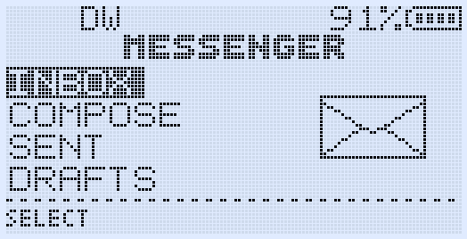
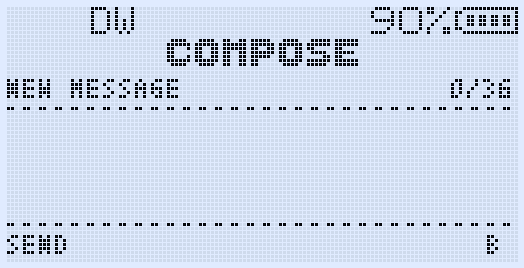
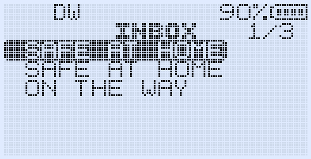
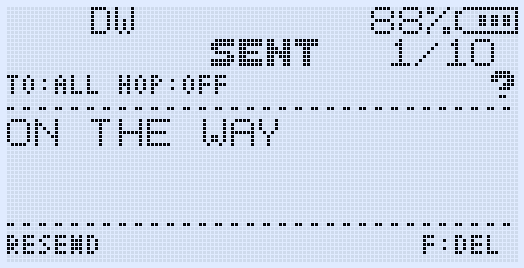

# Stats


---

# GOGUFW - UV-K1 Messenger Firmware

Custom experimental messenger firmware for the Quansheng UV-K1 / K5V3 platform.

Based on:
- F4HWN Fusion
- EGZUMER
- UV-K5 / UV-K1 open firmware ecosystem

GOGUFW focuses on adding a lightweight off-grid FSK messaging system while preserving normal radio usability and voice performance.

---

FOR MESSENGER PRESS F + MENU

# Features

## Messenger System

- FSK text messaging
- ACK / Retry delivery system
- Random ACK delay collision reduction
- Retry timeout protection
- Background RF receive
- Boot-time RF initialization
- Draft message storage
- Sent / Inbox / Drafts UI
- Message resend
- Reply support
- Unread message notification
- Status bar envelope icon
- Persistent settings
- T9 compose keyboard
- Broadcast messaging
- Hop-aware packet structure

---

# Messenger UI Features

## Messenger Home Screen

- Pixel-art menu icons
- Envelope icon for Inbox
- Pencil icon for Compose
- Upload arrow icon for Sent
- Floppy disk icon for Drafts
- Compact LCD-style UI layout
- Small-font metadata rendering
- Dashed separators
- Optimized screen spacing

---

# Compose Screen

- T9 text input
- B / b / 2 mode indicator
- Long-press numeric input
- Character counter
- Draft save support
- 36 character optimized payload length

---

# Inbox / Sent Features

- Compact metadata header
- Hop display support
- Delivery state indicators
- Resend support
- Delete support
- Reply support

---

# RF Features

## ACK / Retry System

- ACK timeout protection
- Randomized ACK delay
- Retry collision reduction
- Delayed retry scheduler
- Improved reliability in multi-radio environments

# Screenshots

## Messenger Home



## Compose Screen



## Inbox



## Sent



---

# Planned Features

- Automatic range check system
- Midland-compatible ping/pong experiments
- Auto range monitoring
- FM radio memory naming
- CHIRP integration updates
- Relay / mesh improvements
- Hop routing improvements
- Additional message tools

---

# Build

Build firmware using Docker:

```bash

chmod +x compile-with-docker.sh

./compile-with-docker.sh Fusion

```

The build output will appear under:

```text

build/Fusion/

```

VS Code build support is included.

## Credits

Huge respect to:

* F4HWN
* EGZUMER
* UV-K5 open firmware contributors
* The Quansheng modding community
* and others I forget

Warning

This firmware is experimental.

Messenger and RF features are still under active development and may contain bugs or unfinished functionality.

Use at your own risk.

## License

Copyright (c) 2023 DualTachyon
Copyright (c) 2024-2025 EGZUMER / F4HWN contributors

Additional modifications and Messenger system:
Copyright (c) 2026 GOGUFW / Gogu-Qs

Licensed under the Apache License, Version 2.0 (the "License");
you may not use this file except in compliance with the License.
You may obtain a copy of the License at

    http://www.apache.org/licenses/LICENSE-2.0

    Unless required by applicable law or agreed to in writing, software
    distributed under the License is distributed on an "AS IS" BASIS,
    WITHOUT WARRANTIES OR CONDITIONS OF ANY KIND, either express or implied.
    See the License for the specific language governing permissions and
    limitations under the License.
